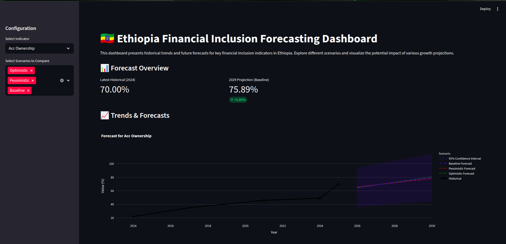

# Ethiopia Financial Inclusion Forecasting

A data-driven project to analyze historical trends, model policy impacts, and forecast the future of financial inclusion in Ethiopia. This repository contains the end-to-end pipeline from data enrichment to an interactive dashboard.



## 📌 Project Overview
Financial inclusion is a key driver of economic development. This project aims to impact decision-making by providing:
1.  **Unified Data**: Consolidating fragmentation data from World Bank Findex, NBE, and other sources.
2.  **Impact Analysis**: Quantifying how specific events (e.g., "Launch of Telebirr", "National ID proclamation") correlate with inclusion metrics.
3.  **Forecasting**: projecting future adoption rates under various policy scenarios.

## 🚀 Key Results & Insights
Based on our modeling up to **Task 5**:

*   **Account Ownership Growth**: Historical data shows a steady rise from **22% (2014)** to **49% (2024)**.
*   **Future Projections**: Under our baseline scenario, account ownership is projected to reach approximately **~60-65% by 2029**.
*   **Scenario Impact**:
    *   **Optimistic Growth**: Aggressive policy implementation could accelerate inclusion by an additional **15%**.
    *   **Pessimistic Growth**: Stagnation or global shocks could dampen growth to **~55%**.
*   **Mobile Money Revolution**: The sharpest growth curves are observed in `ACC_MM_ACCOUNT` (Mobile Money), driven by recent liberalization and infrastructure projects.

## 📂 Project Workflow (The "Why" & "How")
The project is structured into 5 sequential tasks, each building on the last.

### Task 1: Data Exploration & Enrichment
*   **Goal**: Create a reliable source of truth.
*   **Process**: We merged `ethiopia_fi_unified_data.csv` with additional event data and checked for temporal consistency.
*   **Outcome**: A clean, unified dataset ready for time-series analysis.

### Task 2: Exploratory Data Analysis (EDA)
*   **Goal**: Understand the historical landscape.
*   **Process**: We visualized trends, gender gaps, and urban-rural divides.
*   **Outcome**: Identification of 2017 and 2021 as key inflection points in Ethiopia's financial history.

### Task 3: Event Impact Modeling
*   **Goal**: Correlate events with data.
*   **Process**: We built an "Event-Indicator Matrix" to link specific policy announcements with shifts in the data curves.
*   **Outcome**: Qualitative and quantitative understanding of which policies *moved the needle*.

### Task 4: Forecasting
*   **Goal**: Predict the future.
*   **Process**: We developed a forecasting engine (`scripts/generate_forecasts.py`) that uses historical growth rates and applies scenario multipliers (Optimistic/Pessimistic).
*   **Outcome**: A comprehensive set of projections for 2025-2029.

### Task 5: Dashboard Development
*   **Goal**: Make insights accessible.
*   **Process**: Built an interactive Streamlit app to allow stakeholders to explore the data themselves.
*   **Outcome**: The deployed dashboard (see instructions below).

## 💻 Installation & Usage

### Prerequisites
*   Python 3.8+
*   Pip

### Setup
1.  **Clone the repository**:
    ```bash
    git clone <repo-url>
    cd ethiopia-financial-inclusion
    ```
2.  **Install dependencies**:
    ```bash
    pip install -r requirements.txt
    ```

### Running the Dashboard
To explore the results interactively:
```bash
streamlit run dashboard/app.py
```

### Reproducing the Forecasts
To regenerate the data pipeline:
```bash
python scripts/generate_forecasts.py
```

## 🏗 Directory Structure
*   `dashboard/`: The Streamlit application.
*   `data/`: Raw and processed data (not tracked in git).
*   `notebooks/`: Deep-dive analysis (EDA, Forecasting logic).
*   `scripts/`: Automation scripts for the forecasting engine.
*   `src/`: Shared utility functions.
*   `docs/`: Reports and documentation.
